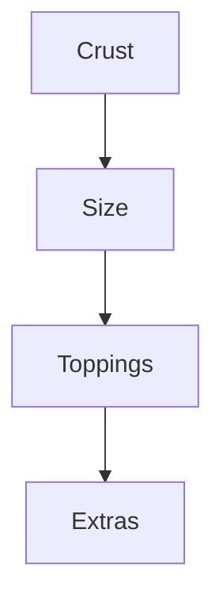

# Menu Price Calculator 🍕📊

A system to calculate minimum and maximum possible prices for menu items with customizable options, following ONDC specifications.

## Features ✨

- **Dynamic Price Calculation**  
  Automatically computes price ranges based on:
  - Base item price
  - Customization options
  - Group configuration rules (min/max selections)

- **Hierarchical Processing**  
  Handles nested customization groups:
```

  Crust → Size → Toppings → Extra Options

```

- **JSON Data Support**  
  Works with standard ONDC catalog format

## Quick Start 🚀

### 1. Prerequisites
- Node.js v16+
- TypeScript (`npm install -g typescript`)

### 2. Installation
```bash
git clone https://github.com/yourusername/menu-price-calculator.git
cd menu-price-calculator
npm install
```

### 3. Prepare Catalog Data

Create `catalog.json` in `/data` folder:

```json
{
  "categories": [...],
  "items": [...]
}
```

### 4. Run Calculator

```bash
npm start
```

## Configuration ⚙️

### Catalog Structure

```javascript
{
  "categories": [
    {
      "id": "CG1",
      "descriptor": { "name": "Crust" },
      "tags": [
        {
          "code": "config",
          "list": [
            { "code": "min", "value": "1" }, // Required selections
            { "code": "max", "value": "1" }
          ]
        }
      ]
    }
  ],
  "items": [
    {
      "id": "pizza-001",
      "price": { "value": "299" },
      "tags": [
        {
          "code": "custom_group",
          "list": [{ "value": "CG1" }] // Linked groups
        }
      ]
    }
  ]
}
```

## Key Concepts 📘

### 1. Custom Groups

Define customization steps:



### 2. Price Calculation

- **Minimum Price** = Base price + cheapest required options
- **Maximum Price** = Base price + most expensive allowed options

### 3. Group Rules

Each group specifies:

- `min`: Minimum selections required
- `max`: Maximum selections allowed
- `input`: Selection type (dropdown/checkbox)

## Example Calculation 🧮

For a pizza with:

- Base price: ₹299
- Customizations:
  - Crust (choose 1)
  - Size (choose 1)
  - Toppings (choose 0-3)

**Sample Output**:

```
Calculated Price Ranges:
Item pizza-001: ₹299 - ₹799
```

## Troubleshooting 🔧

### Common Issues

| Problem                | Solution                        |
| ---------------------- | ------------------------------- |
| Prices too low/high    | Check group `min/max` values  |
| Missing customizations | Verify parent-child group links |
| Incorrect calculations | Validate price values in JSON   |

### Debugging

Enable detailed logs:

```typescript
// In calculator.ts
private debugEnabled = true;
```

Sample debug output:

```
[DEBUG] Processing group CG1 (Crust)
[DEBUG] Selected customization: Thin Crust (₹0)
[DEBUG] Child groups: CG2 (Size)
```

## Contributing 🤝

1. Fork the repository
2. Create feature branch (`git checkout -b feature/amazing-feature`)
3. Commit changes (`git commit -m 'Add amazing feature'`)
4. Push to branch (`git push origin feature/amazing-feature`)
5. Open Pull Request

